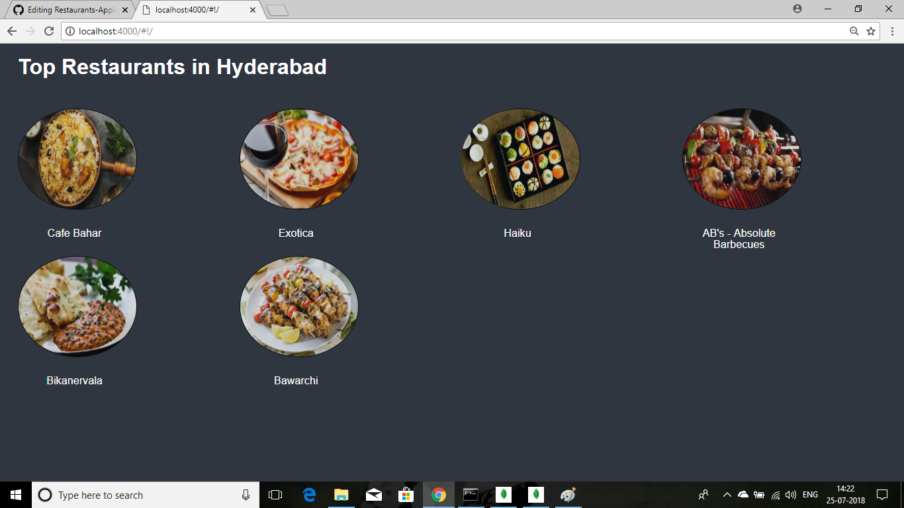
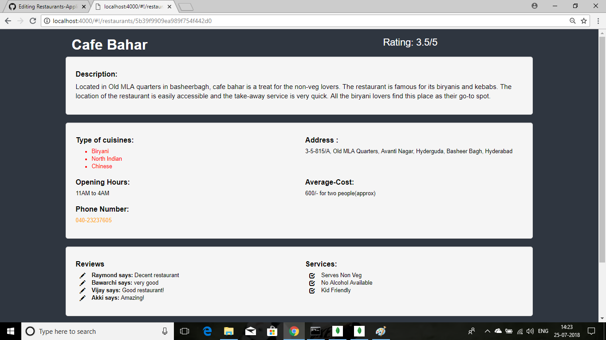
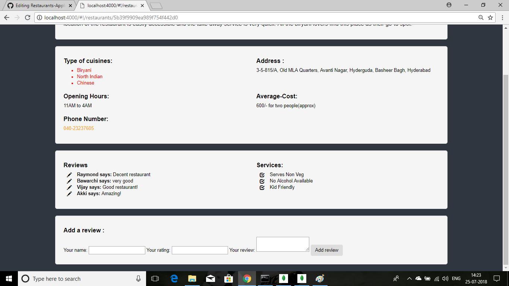

# Restaurants-Application
This is an application developed using MEAN(MongoDB, Express.js, AngularJS and Node.js) stack.

# About the Application
This application contains top restaurants in hyderabad and information related to each of the restaurants. We can add reviews to each of the restaurants. 

# How it works?
I created a database of restaurants and updated it in MongoDB, then using Node.js and Express.js I set up routes for the application.  
Using 'Mongoose' I connected the application to the database and finally using AngularJS i presented it in the browser.

# Screenshots of Application : 

# Home-page:

                                  
# Individual Restaurant Information page :

